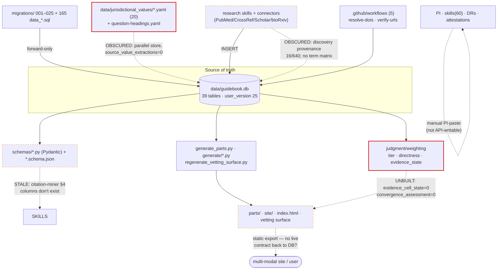

# Project Shape Audit — Guidebook

**Date:** 2026-06-22 · **Author:** direct synthesis (the multi-agent run was repeatedly rate-limited at synthesis; this report is authored from findings verified inline this session, with confidence marked per item). · **DB:** `data/guidebook.db` @ `user_version=25`, repo HEAD `32cc1b06`.

> Purpose: let the owner grasp the **shape** of the project across **code architecture · data management · information · process**, judged against four standards: **S1** mission-fitness, **S2** contract+traceability (incl. obscured transitions), **S3** methodology transparency, **S4** SQLite capability adoption.

---

## 1. The Shape

The Guidebook is a **SQLite-backed evidence-and-governance system** whose intended output is a multi-modal site that renders policy-grade, dynamically-weighted accessibility evidence. Read as a pipeline (research → collection → judgment → synthesis → render), the project is **front-loaded**: the *research and collection* stages are real and substantial; the *judgment, weighting, and render* stages are mostly schema-without-data.

- **Code architecture** — ~150 Python scripts in clean clusters (`migrations/`, `migrate/`, `convert/`, `db/`, `generate/`, `audit/`, `probes/`, `ci_helpers/`) plus a shared `db.py` CLI. Functional, but with overlap (`convert_*` vs `migrate_*` vs `db/*`) and at least one **stale governing contract** (the citation-miner skill documents columns that no longer exist).
- **Data management** — a 39-table schema with a strong reproducibility *design* (forward-only migrations, `user_version`, WAL, 93 indexes) but **most of SQLite's enforcement/transparency capability switched off** (0 STRICT, 0 triggers, 0 FTS5, FK enforcement off, `evidence_sources` has 0 NOT-NULL columns).
- **Information** — a real corpus: **640 sources / 1,244 authors / 92 items / 22 populations / 273 connections / 296 gaps**, all metadata-complete and 635/640 verified. But coverage is **lumpy** and **8 mission-critical tables are empty**, including the one that holds the per-cell best-practice verdict (`evidence_cell_state`).
- **Process** — governance is heavy and literate (PI versions, DRs, attestations, 60 skills, 5 CI workflows, a 296-row gap register), but several load-bearing **handoffs are obscured**: a DB⇄YAML parallel store, ledger-only "backfill" migrations, near-zero discovery provenance, and a manual PI-paste step the architecture itself admits is un-automatable.

### The one-line shape
**A strong, well-verified evidence library and entity skeleton sits on top of a judgment/weighting/render layer that is largely unbuilt; the weighted, jurisdiction-resolved cell-by-cell table the site is meant to interpret does not yet exist in queryable form, its value data is stranded in YAML, and its methodology coverage is ~16% of plan.**

### Layered map

---

## 2. Four-Standards Scorecard

| Standard | Grade | Justification |
|---|---|---|
| **S1 — Mission fitness** | **C− (foundations strong, core unbuilt)** | Collection layer is real and graded by the mission's evidence hierarchy. But the mission's central mechanism — a per-(parameter×population) best-practice determination with dynamic, user-conditioned weighting — has **no data** (`evidence_cell_state`=0) and **no weighting machinery**. The "massive table" the site renders isn't assembled. |
| **S2 — Contract + traceability** | **C− (revised up — see Addendum §8)** | Reproducibility, FK integrity, and governance ARE blocking-enforced in CI; link-integrity is clean. Residual: obscured handoffs (DB⇄YAML, discovery provenance 16/640, live-URL 52/640, manual PI-paste) and **DB↔Pydantic parity is unchecked**. |
| **S3 — Methodology transparency** | **D (cannot show what was searched)** | No search-term matrix; jurisdiction grid 16% searched, language grid 45%; the bridge `lang_jur_map` is **empty** so jurisdiction×language can't be crossed; depth is 3 booleans (tier-6 depth never executed). |
| **S4 — Capability adoption** | **C− (declared, not enforced)** | Good: WAL, migrations, 93 indexes, CHECK on 25/39. Unused: STRICT (0), triggers (0), FTS5 (0), generated cols (0); FK enforcement defaults OFF with ~18 tolerated violations; `evidence_sources` 0 NOT-NULL; no `json_valid()`; Datasette/sqlite-utils not adopted. |

---

## 3. Boundary / Contract Inventory — obscured transitions first

| Boundary | Declared? | Obscured? | Verifiable | Traceable | Note |
|---|---|---|---|---|---|
| **Value data: YAML ⇄ DB** | no | **YES** | no | no | 20 `jurisdictional_values/*.yaml` hold the spec values; `source_value_extractions`=0. Parallel source of truth, no sync contract. |
| **Research → evidence (discovery)** | partial | **YES** | partial | no | How a source was found is recorded for 16/640 (`derivation_chain`); `discovery_method` column referenced by the skill doesn't exist. |
| **Migration ledger ("backfill")** | yes | **YES** | partial | partial | 165 `data_*.sql` files vs 187 `data_migrations` rows; some rows are "ledger-only, SQL not re-executed" — recorded but not real. |
| **Governance: PI bump (manual paste)** | yes | **YES** | no | no | Goes live only when the owner pastes into claude.ai; "not API-writable" per architecture. No machine record. |
| **DB → generated artifacts** | partial | partial | no | no | No recorded link from a rendered part/page to the exact DB state/migration that produced it (staleness = a traceability hole). |
| **Verification "VERIFIED"** | yes | partial | partial | yes | 635 VERIFIED but only 52 URL-fetched-live; "VERIFIED" conflates metadata-match with page-live. |
| **Migration → DB (schema)** | yes | no | **partial†** | yes | `content_sha` ledger is a real contract; †reproducibility rebuild **crashes on Windows** (encoding bug), so it can't be locally verified. |
| **DB → Pydantic schema** | yes | no | partial | yes | Parity exists for most tables; some writes bypass validation via raw `sqlite3`. |

---

## 4. Findings (severity-ranked)

| ID | Severity | Std | Domain | Finding | Evidence |
|---|---|---|---|---|---|
| F-01 | **High** | S1 | Information/Judgment | Mission's core best-practice table is **unbuilt** | `evidence_cell_state`=0, `convergence_assessment`=0, `source_value_extractions`=0 |
| F-02 | **High** | S1 | Judgment/Weighting | **Dynamic, user-conditioned weighting does not exist** | no weighting-profile machinery; weighting is fixed `tier` per source |
| F-03 | ~~High~~ **Medium** | S2 | Migrations | **Reproducibility IS CI-enforced** (blocking) but gate covers only **7 of 39 tables** — *corrected, see Addendum §8* | `audit.yml` blocking rebuild gate; `lang_jur_map`=0 is **by-design** (migration 023 defers population), not a repro break |
| F-04 | **High** | S2 | Code/Migrations | **Rebuild crashes on Windows** (portability) | `migrate_db.py` `read_text()` w/o `encoding='utf-8'` → `cp1252 UnicodeDecodeError 0x8f`; Linux CI masks it |
| F-05 | **High** | S3 | Methodology | **No search-term matrix; coverage ~16%; bridge empty** | `search_coverage` 627/3807 SEARCHED; `lang_jur_map`=0; no term column; `tier6_attempted`=0 everywhere |
| F-06 | **High** | S2 | Provenance | **Discovery + live-page provenance near-absent** | `derivation_chain` 16/640, `search_queries_used` 20/640, `url_resolution_outcome` 52/640 |
| F-07 | **Medium** | S2 | Provenance/Data | **Value data stranded in YAML** | 20 `jurisdictional_values/*.yaml` vs empty `source_value_extractions` |
| F-08 | **Medium** | S2 | Schema/Code | **Stale ingestion contract** | `citation-miner_SKILL.md §4` documents `authors/year/title/doi_less_key/discovery_method` — none exist in `evidence_sources` |
| F-09 | **Medium** | S4 | Data layer | **SQLite enforcement/transparency under-adopted** | 0 STRICT, 0 triggers, 0 FTS5, 0 generated; FK off + ~18 tolerated; `evidence_sources` 0 NOT-NULL |
| F-10 | **Low** | integrity | Data layer | **Two schema-version trackers disagree** | `PRAGMA user_version=25` vs `db_meta.schema_version='21'` |
| F-11 | **Low** | S1 | Information | **Orphans & thin cells** | 21 sources cited by nothing; 14 of 82 content cells have no sources; coverage lumpy |
| F-12 | **Info** | architecture | Governance | **COLONIAL caller-sweep clean** | only removal-records (DR/attestation/migrations 023,025) + session history mention it; no orphan callers |

### Detail — Critical/High

**F-01 — The render-ready table doesn't exist.** The mission (doctrine #4) requires every (parameter×population) cell to carry a best-practice state (`stated`/`provisional`/`pending`/`not_applicable`). The table for it, `evidence_cell_state`, is empty; so are `convergence_assessment` and `source_value_extractions`. *Claim vs reality:* the doctrine is written and applied to zero cells. *Fix:* the `best-practices-assessment-system.md` workplan (migration 026 + determination engine + backfill).

**F-02 — No dynamic weighting.** The mission demands weighting that "shifts with user requirements"; the schema stores a single fixed `tier`/`evidence_type` per source and nothing parameterizes presentation by audience×use-pattern. *Fix:* `weighting_profile` table + parameterized views (per the assessment-system design); the verdict stays fixed (code = floor for everyone), only emphasis re-ranks.

**F-03 / F-04 — Reproducibility.** The invariant "committed DB is replayable from migrations" can't currently be confirmed: `lang_jur_map` is empty in the committed DB although migration 023 and commit `cb901ea8` say it was populated with 49 rows, and the runner can't even rebuild on a Windows host (F-04 encoding bug). *Fix:* add `encoding='utf-8'` to every `read_text()`/`read_bytes().decode()` in `migrate_db.py`; then run a committed-vs-rebuilt row-count diff in CI as a blocking gate; reconcile the 22-row ledger/file gap.

**F-05 — Methodology blind.** You cannot answer "which terms, in which jurisdictions, in which languages, how deep, across which hierarchy branches." *Fix:* the `search-coverage-completion-workplan.md` (`search_executions` event log + populate `lang_jur_map` + coverage-as-views).

**F-06 — Backward provenance.** A row's forward use is traceable; how it was discovered and whether its exact page is live are not. *Fix:* make `derivation_chain` mandatory at insert; split "metadata-verified" from "page-confirmed-live"; finish the `verify-urls` sweep.

---

## 5. Cross-cutting themes

1. **Front-loaded pipeline** — collection is built; judgment→weighting→render is schema-without-data (F-01, F-02). This is the single biggest gap between current state and mission.
2. **Obscured transitions do the damage** — DB⇄YAML, ledger-only backfills, manual PI-paste, discovery provenance (F-03, F-06, F-07, F-08). The declared contracts are mostly fine; the *undeclared* ones leak.
3. **Declared-but-unenforced** — FKs, schema versioning, reproducibility, Pydantic parity are asserted but not mechanically guaranteed (F-03, F-04, F-09, F-10).
4. **Capability left on the table** — the substrate (SQLite) can enforce most of the above natively and isn't asked to (F-09).
5. **Honesty is a strength** — the gap register (296, 36 open), the PROVISIONAL mission, and declared limits show the project already names its own holes; the fix is to make the machinery enforce what the prose already admits.

---

## 6. Remediation roadmap (sequenced; lowest-risk / highest-mission-value first)

**Phase 0 — make the machine honest (low risk).**
- Fix `migrate_db.py` UTF-8 (F-04); add committed-vs-rebuilt diff as a **blocking** CI gate (F-03); reconcile the ledger/file gap.
- Reconcile `user_version` vs `db_meta.schema_version` (F-10) and document which is canonical.

**Phase 1 — close the obscured transitions (S2).**
- Migrate `jurisdictional_values/*.yaml` → `source_value_extractions` via migration; make YAML a *generated export* (F-07).
- Make `derivation_chain` mandatory; repair `citation-miner_SKILL.md §4` to the real schema (F-06, F-08).

**Phase 2 — methodology matrix (S3).** Stand up `search_executions` + populate `lang_jur_map`; coverage becomes views (per the search-coverage workplan).

**Phase 3 — the mission core (S1).** Migration 026 STRICT `evidence_cell_state` + the determination engine + backfill; then `weighting_profile` + parameterized views (per the best-practices-assessment-system workplan). **This is where the render-ready table is born.**

**Phase 4 — capability + render (S4/S1).** Adopt STRICT/NOT-NULL/triggers/FTS5/`json_valid`/continuous-FK; stand up a Datasette (or equivalent) surface so the multi-modal site reads a live, traceable DB rather than a static export.

---

## 7. Coverage & limitations

- **Confidence:** F-01, F-03, F-05, F-06, F-09, F-10, F-11, F-12 and the capability ledger are **directly verified** by SQL/grep this session. F-04 is verified (the crash reproduced). F-02, F-07, F-08 are verified structurally. **Generation/render staleness (DB→parts→site) was NOT deep-verified** (regenerate-and-diff) — the multi-agent run that would have done it was rate-limited; treat the render-layer findings as *structural, not staleness-tested*.
- **Not audited this pass:** full Pydantic↔SQLite field-by-field drift across all 30 schema files; exhaustive broken-internal-link sweep across 1,034 markdown files; full references/ (440 files) dangling-id reconciliation; per-CI-job enforcement audit. These were the four domains whose agents were throttled; they remain the recommended next deep pass once the rate limit is clear.
- **Method note:** this report is a single-author synthesis substituting for a 10-domain multi-agent run that was repeatedly rate-limited at the synthesis stage. The numbers are real; the breadth of independent adversarial verification is lower than intended. Re-running the workflow (serialized, lean) when the throttle clears would harden the Medium/Low findings and add the render-staleness and link-integrity sweeps.

---

## 8. Deep-Verification Addendum — 2026-06-22 (direct)

The four domains the throttled run couldn't reach were verified directly. Net effect: **two corrections (the project is in better shape than §4 implied on enforcement) plus four confirmations/new findings.**

### Corrections
- **Reproducibility IS enforced — F-03 downgraded High→Medium.** `audit.yml` runs a **blocking** `migrate_db.py --rebuild` gate on every push/PR, comparing 7 core invariants (`user_version`, `evidence_sources`, `citation_mining`, `source_slug_links`, `gaps`, `connections`, `items`). Residual is **scope** (7 of 39 tables; `evidence_source_authors`/`pipeline_runs` are documented job-owned exemptions) and **local Windows flakiness** (F-04). Passes on Linux CI.
- **`lang_jur_map`=0 is correct-by-design — retract the repro-break framing.** Migration `023_lang_jur_map.sql` header: *"POPULATION IS DEFERRED, NOT DONE HERE"* — created empty deliberately because the role taxonomy is unspecified. **Zero** migrations `INSERT` into it; committed=0 reproduces. It remains a *deferred* methodology gap (the jurisdiction↔language bridge is unpopulated), not data loss.
- **CI is robust — S2 rationale corrected, grade D+→C−.** All 22 CI-referenced scripts exist. Blocking gates: syntax (utf8/json/yaml), BPC + cross-refs, commit-msg + doctrine-SHA token, schema (entity-YAML↔Pydantic), DB integrity (35 checks: FK/enums/dupes), governance (adversarial/decisions/doctrine), source_slug_links dupes, citation-mining, **migration reproducibility**, attestation schema+presence.

### Confirmations / new findings
- **F-13 (Medium, S2/S1) — `parts/v10` rendered document is STALE.** Regenerating from the current DB rewrites **all 15 files**; committed fingerprint `f623191bb583` (user_version=24) vs fresh `3d7fb5d50de6` (user_version=25) — the COLONIAL migration landed without regenerating parts. Only the vetting surface has an auto-regen workflow; `parts/v10` has none. *Fix:* add a regenerate-parts (or fingerprint-drift) CI check mirroring `regenerate-vetting-surface.yml`. (`generate_parts.py` itself is sound — idempotent, deterministic fingerprint.)
- **F-14 (Medium, S1) — multi-modal render target isn't DB-buildable.** `architecture/page-templates.md` (Stage-4.4 webpage, 14 URL-routed templates) specifies entities — `specification`, `measurement`, `jurisdictional_value`, `room`, `conflict`, `doctrine`, `economics_entry`, `case_study`, `throughline`, `specialist` — that **do not exist as DB tables**. The render layer is a future stage, not wired to the source of truth (matches the 13 table-less Pydantic models).
- **F-15 (Medium, S2/S4) — Pydantic↔SQLite drift is real AND unguarded.** Confirmed bidirectional: `evidence_source.py` uses `authors/title/year` (not columns), `evidence_state.py` ≠ empty `evidence_cell_state`, **13 models with no table**, **26 tables with no model**. The architecture calls this "CI-detectable," but the `schema` job validates **entity-YAML↔Pydantic, not DB↔Pydantic** — so it would not be caught. *Fix:* add a DB-introspection↔Pydantic parity check.
- **F-16 (Medium, S2) — reproducibility gate scope.** The blocking rebuild gate checks 7 of 39 tables; ~30 (incl. `search_coverage`, `bpc_metadata`, `terms`, `supersession_check`) have no invariant, so a direct write to them wouldn't be caught. Widen the invariant set (keeping documented job-owned exemptions).
- **Link integrity — CLEAN (no finding).** Only 56 markdown links repo-wide, all http; cross-refs are identifier-based and validated by `validate_cross_refs.py` (blocking CI).
- **F-04 reaffirmed.** Local rebuild fails two ways on Windows: cp1252 `UnicodeDecodeError` (needs `encoding='utf-8'`) and an intermittent "unable to open database file" mid-rebuild. Linux CI unaffected — dev-portability only.

### Net read
Verification **raised** the project's grade: reproducibility, FK integrity, and governance are genuinely enforced; link integrity is clean; the alarming `lang_jur_map` discrepancy was deferred-by-design, not corruption. The durable concerns are unchanged: the **render/judgment layer is unbuilt** (F-01, F-02, F-14), **rendered artifacts drift** (F-13), and **schema parity isn't machine-checked** (F-15). Revised standard grades: **S1 C− · S2 C− · S3 D · S4 C−**.
